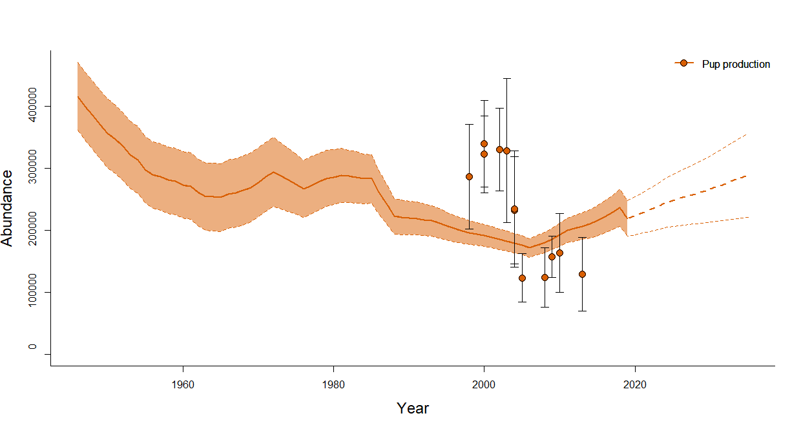

How to use the *rSPAMM* package
================
T. A. Øigård and M. Biuw
2019-12-23

# Overview

The purpose of this vignette is to show how to use the *rSPAMM* package
for assessment of various harp and hooded seal populations. It will
guide you through the model fitting, obtaining estimated quantities,
finding and exploring, various catch options, how to structure the data
set, and how to visualize the modelled population dynamics. We also
present the model used.

# Installation of the *rSPAMM* package and how to update it

The most recent version of *rSPAMM* is hosted on a git repository at
<https://github.com/NorskRegnesentral/rSPAMM.git>.

We recommend to use the RStudio software and the instructions assumes
that the user makes use of this software. More advanced users not using
RStudio will be able to follow the installation procedure described
below and do it manually. In order to download the rSPAMM package you
han download it from Git Hub by cloning the Git repository. In RStudio
you do the following steps:

  - Select: File -\> New project
  - Select: Version control
  - Select: Git
  - In the “Repository URL” box type:
    <https://github.com/NorskRegnesentral/rSPAMM.git>
  - Fill in the rest of the boxes depending on where you want the
    package stored on your computer
  - In the console window type:

<!-- end list -->

``` r
source("install_rSPAMM.R")
```

The *rSPAMM* package is now installed. To load the package type

``` r
library(rSPAMM)
library(TMB)
```

If you want to update the package to the most recent version you find
the Git menu in the panel to the top right corner of RStudio. From there
you click on the Pull button and then it will download the most recent
version of *rSPAMM*. You have to install the package again by sourcing
the installation script again.

# Data used by the population dynamics model and how to load them

The population dynamics model use historical catch records, fecundity
rates, age specific proportions of mature females, and estimates of pup
production to estimate the population size trajectory. Two types of
reproductive data are used in the model: information on the proportion
of females that are mature at a given age (i.e., maturity ogive) and the
proportion of mature females that are pregnant at a given year
(i.e. fecundity rate). In this section we will describe what type of
data is used, which data files are needed, and the format the various
data are stored.

# Data files

All data that is described below will be loaded and used by the model to
fit the population dynamics. All data sets are found in the *Data/*
folder separated into folders for each population.

## Catch data

Catch data are found in the file *catch\_data.dat* and the content of
the file looks like this:

    ##     V1     V2    V3
    ## 1 1946 105631 64742
    ## 2 1947 105631 64742
    ## 3 1948 105631 64742
    ## 4 1949 105631 64742
    ## 5 1950 105631 64742
    ## 6 1951  67793 76448

The first column contains the year, the seccond column contains the
catch of pups, and the third column contains the catch of the 1+
population.

## Pup production estimates

Estimated pup production is found in the file *pup\_production.dat*. The
content of the file looks like this:

    ##      V1     V2    V3
    ## 1  1998 286260 0.150
    ## 2  2000 322474 0.098
    ## 3  2000 339710 0.105
    ## 4  2002 330000 0.103
    ## 5  2003 328000 0.181
    ## 6  2004 231811 0.190
    ## 7  2004 234000 0.205
    ## 8  2005 122658 0.162
    ## 9  2008 123104 0.199
    ## 10 2009 157000 0.108
    ## 11 2010 163032 0.198
    ## 12 2013 128786 0.237

In the first column you see the survey year, in the seccond column you
see the estimated pup production, and in the third the estimated CV of
that survey is given.

## Fecundity data

Fecundity data is found in the *fecundity.dat* file. The content of the
file looks like this:

    ##     V1   V2   V3
    ## 1 1990 0.84 0.06
    ## 2 1991 0.84 0.06
    ## 3 1992 0.84 0.06
    ## 4 1993 0.84 0.06
    ## 5 2006 0.68 0.06
    ## 6 2011 0.84 0.06
    ## 7 2018 0.91 0.03

In the first column you have the year for when the fecundity is
estimated, in the seccond column you have the estimated fecundity, and
in the thirst column you have the estimated standard error of the
fecundity estimate.

## Birth ogive

In the files *wgharp.ogi* and *wgharp.ogp* you find the birth ogive
data, and the from which time periods the birth ogive curves applies
for. The content of the *wgharp.ogi* looks like

    ##    Age   P1   P2   P3   P4   P5
    ## 1    1 0.00 0.00 0.00 0.00 0.00
    ## 2    2 0.00 0.00 0.00 0.01 0.00
    ## 3    3 0.01 0.00 0.00 0.02 0.00
    ## 4    4 0.17 0.00 0.02 0.05 0.00
    ## 5    5 0.64 0.24 0.08 0.11 0.00
    ## 6    6 0.90 0.62 0.21 0.25 0.52
    ## 7    7 0.98 0.81 0.40 0.55 0.77
    ## 8    8 0.99 0.91 0.59 0.90 0.89
    ## 9    9 1.00 0.95 0.75 0.99 0.95
    ## 10  10 1.00 0.98 0.85 1.00 0.97
    ## 11  11 1.00 0.99 0.91 1.00 0.99
    ## 12  12 1.00 0.99 0.95 1.00 0.99
    ## 13  13 1.00 1.00 0.97 1.00 0.99
    ## 14  14 1.00 1.00 0.98 1.00 1.00
    ## 15  15 1.00 1.00 0.99 1.00 1.00
    ## 16  16 1.00 1.00 1.00 1.00 1.00
    ## 17  17 1.00 1.00 1.00 1.00 1.00
    ## 18  18 1.00 1.00 1.00 1.00 1.00
    ## 19  19 1.00 1.00 1.00 1.00 1.00
    ## 20  20 1.00 1.00 1.00 1.00 1.00

In the first column the age group is listed and in the following columns
a birth ogive curve is listed for a given period. Every time a new birth
ogive estimated is available, a new column is added. The content of the
*wgharp.ogp* looks like

    ##   Pstart Pstop
    ## 1   1962  1972
    ## 2   1976  1985
    ## 3   1988  1993
    ## 4   2006  2006
    ## 5   2018  2018

The first column denotes the start of the time period a given birth
ogive curve applies for, and the second column denotes the end of the
time period the birth ogive curve is valid. The reason for this is that
usually data for several years are pooled together when estimating the
birth ogive curve in order to ensure enough data to obtain a reasonable
estimated of the birth ogive. Note that the number of rows in the
*wgharp.ogp* file corresponds to the number of columns in the
*wgharp.ogi* file (minus 1 since one column represents the age group).

## Priors used

Priors used for the various parameters are specified in the *priors.dat*
file. The content of the file looks like this:

    ##        V1    V2
    ## 1 1.0e+06 2e+05
    ## 2 9.0e-02 5e-02
    ## 3 2.7e-01 5e-02

Each row specify mean and the standard deviation of a Gaussian prior
used for a given parameter. In the first colum the mean value is found
and in the second column the standard deviation is found. In the first
row the prior distribution of the initial population size \(K\) is
specified, in the seccond row the prior distribution of the 1+ mortality
\(M\) is specified, and in the third row the prior distribution of the
pup mortality \(M_0\) is specified.

## Loading the data

In order to load the data you have to specify which population you want
to load the data for. The various alternatives are *harpeast*,
*harpwest*, and *hooded* (which is the hooded seal population in the
West Ice - the ice along the east coast of Greenland). In the examples
that follows we will use the *harpeast* population. To load the data
used you run the following command:

``` r
data <- load.data(population = "harpeast")
```

To explore the data object you can

``` r
names(data)
```

    ##  [1] "Amax"              "Cdata"             "Nc"               
    ##  [4] "pupProductionData" "Np"                "Ftmp"             
    ##  [7] "Pmat"              "Npred"             "priors"           
    ## [10] "Npriors"           "CQuota"            "Pper"

The data object is a list and you can further explore the actual values
used by e.g.,

``` r
data$Amax
```

    ## [1] 20

``` r
data$pupProductionData
```

    ##         V1     V2    V3
    ##  [1,] 1998 286260 0.150
    ##  [2,] 2000 322474 0.098
    ##  [3,] 2000 339710 0.105
    ##  [4,] 2002 330000 0.103
    ##  [5,] 2003 328000 0.181
    ##  [6,] 2004 231811 0.190
    ##  [7,] 2004 234000 0.205
    ##  [8,] 2005 122658 0.162
    ##  [9,] 2008 123104 0.199
    ## [10,] 2009 157000 0.108
    ## [11,] 2010 163032 0.198
    ## [12,] 2013 128786 0.237

# Parameters to be estimed and how to load them

As briefly mentioned earlier the population dynamics model is described
by three parameters. The initial population size \(K\), the mortality of
the 1+ population \(M\), and the pup mortality \(M_0\). The initial
population size is the population size for the year the model is fit
from, and this is determined by the availability of the catch data. The
earliest catch data is from 1946, so the model is fit from 1946 and up
to present. It also predicts the population dynamics into the future,
and this is default set to 15 years.

To load the initial values of the parameters to be estimated run:

``` r
parameters <- load.initial.values(population = population)
```

The parameters object is also a list and the content looks like this for
the *harpeast* population

``` r
parameters
```

    ## $logK
    ## [1] 15.42495
    ## 
    ## $Mtilde
    ## [1] -2.090741
    ## 
    ## $M0tilde
    ## [1] 0.2006707

Here *logK* is the log transformed initial population size, *M0tilde* is
the logit transformed pup mortality, and *Mtilde* is the logit
transformed 1+ mortality (seals of age 1 and greater). The reason that
transformed parameters are estimated instead of the non transformed
parameters is that the log transformation of the initial population
ensures that the model provides a stricktly positive estimate of the
initial population. The logit tranformation of the mortalities ensures
that the estimates are bounded between 0 and 1.

# Model fitting and obtaining estimates

The model is implemented in the Template Model Builder framework and
makes use of the *TMB* R package. This means that the code for model is
written in C++ and will thus have to be compiled first time you try to
fit a model. It will also have to be recompiled if the model is updated.
This is not something the user need to worry about. When installing the
*rSPAMM* package the *TMB* package and all dependencies should also be
installed automatically, and when loading the model it automatically
checks wether the C++ code needs to be compiled or not. If it needs to
be compiled it is done automatically.

## Loading the model object and fitting the model

When compiling the model a model object, a *.dll* file is created and
this has to be loaded first. This is done by running:

``` r
obj = load.model.object(dat = data,par = parameters)
```

The *obj* object is an object containing the log-likelihood value and
the gradient for the initial parameters. This is used by fitting the
model using an ordinary built in optimization routine in R. The default
optimization routine used is *nlminb*, but this can be changed. (MARTIN:
bør vi legge inn en mulighet til å endre optimiseringsrutiner). The
content of the *obj* object looks like this:

``` r
names(obj)
```

    ##  [1] "par"      "fn"       "gr"       "he"       "hessian"  "method"  
    ##  [7] "retape"   "env"      "report"   "simulate"

The value of the log likelihood and the gradient of the log likelihood
for a given set of parameters can be explored by

``` r
obj$fn()

obj$gr()
```

``` r
obj$fn()
```

    ## [1] 24469.39

``` r
obj$gr()
```

    ##          [,1]      [,2]      [,3]
    ## [1,] 75553.49 -327272.3 -60588.86

To fit the model run:

``` r
opt <- run.model(object = obj)
```

When the model is fitted some key information will be written to screen.
This key information show whether the model converged, what type of
convergence and estimates of the parameters that describes the modelled
population dynamics. It might look like this:

## Obtaining the estimated quantities

In addition to the estimated parameters needed to describe the modelled
population dynamics of a population the model fit also provides the user
with other relevant quantities. The Table below lists the various
quantities obtained.

| Variable name  | Description                                                           |
| :------------- | :-------------------------------------------------------------------- |
| rep            | Estimated quantities                                                  |
| rep.matrix     | Matrix containing estimated quantities                                |
| rep.names      | Names of estimated quantities                                         |
| indN0          | Indexes of where the fitted pup population is found in the rep.matrix |
| indN1          | Indexes for the modelled 1+ population                                |
| indNtot        | Indexes for the total population                                      |
| indD1          | Index for the estimated of D                                          |
| indD1new       | Index for the estimated D1new                                         |
| indN0Current   | Index for the modelled pup abundance in the current year              |
| indN1Current   | Index for the modelled 1+ abundance in the current year               |
| indNtotCurrent | Index for the modelled total population in the current year           |
| years          | The years the model is fitted for                                     |
| Kest           | Estimated initial population size                                     |
| Kest.sd        | Standard deviation of the initial population size                     |
| Mest           | Estimated 1+ mortality                                                |
| Mest.sd        | Standard deviation of the 1+ mortality                                |
| M0est          | Estimated pup mortality                                               |
| M0est.sd       | Standard deviation of the estimated pup mortality                     |
| D1             | Estimated depletion coefficient                                       |
| D1Nmax         | Estimated of depletion coefficient using Nmax and Npred               |
| N0Current      | Estimated pup abundance for the current year                          |
| N1Current      | Estimated 1+ abundance for the current year                           |
| NtotCurrent    | Estimated total abundance for the current year                        |
| D1.sd          | Standard deviation of estimated D                                     |
| D1Nmax.sd      | Standard deviation of estimated D using Nmax and Npred                |
| N0Current      | Standard deviation of current pup abundance                           |
| N1Current      | Standard deviation of current 1+ abundanceI                           |
| NtotCurrent    | Standard deviation of current total abundance                         |

The model results can be obtained by running:

``` r
res <- model.results(dat = data,object = obj,optimized = opt)
```

The *res* object is a list containing all the estimates of the
quantities listed in the Table above.

``` r
names(res)
```

    ##  [1] "rep"            "rep.matrix"     "rep.rnames"     "indN0"         
    ##  [5] "indN1"          "indNTot"        "indD1"          "indNmax"       
    ##  [9] "indN0Current"   "indN1Current"   "indNTotCurrent" "years"         
    ## [13] "Kest"           "Kest.sd"        "Mest"           "Mest.sd"       
    ## [17] "M0est"          "M0est.sd"       "D1"             "DNmax"         
    ## [21] "N0Current"      "N1Current"      "NTotCurrent"    "NTotmax"       
    ## [25] "D1.sd"          "DNmax.sd"       "N0Current.sd"   "N1Current.sd"  
    ## [29] "NTotCurrent.sd"

A table for the most interesting quantities needed can be made by
running:

``` r
partab <- par.table(results=res, dat=data) 
```

``` r
partab 
```

    ##             par    parNames         Mean           SD
    ## 1          Kest       N1946 1.710731e+06 1.414960e+05
    ## 2         M0est          M0 2.691386e-01 2.532728e-01
    ## 3         M1est         M1+ 1.286299e-01 5.159749e-02
    ## 4     N0Current     N0,2019 2.188735e+05 1.478594e+04
    ## 5     N1Current    N1+,2019 1.268621e+06 8.980014e+04
    ## 6   NTotCurrent NTotal,2019 1.487495e+06 1.038380e+05
    ## 7            D1         D1+ 1.258786e+00 7.413898e-02
    ## 8 NTotprojected NTotal,2035 1.902521e+06 2.304222e+05

# Visualize the modelled population dynamics

In this section we will show how to create graphics to present the
various output of the modelling results. To display the modelled pup
abundance and the 1+ abundance you run the following command:

``` r
plot.N(res,data)
```


You can also plot the fit to the pup abundance and the 1+ abundance
separately by specifying that in the *component* variable:

``` r
plot.N(res,data,component = c("N0"))
```



``` r
plot.N(res,data,component = c("N1"))
```


You can also choose to not plot the future projections by setting
*projections = FALSE* .

``` r
plot.N(res,data,projections = FALSE)
```


The confidence intervals can be turned off by setting *conf.int = FALSE*
and the horizontal lines for \(N_{lim}\), \(N_{50}\) and \(N_{70}\) can
be turned off by setting *plot.Nlims = FALSE*. For other options you can
run *?plot.N*.

If you want to visualize certain types of data you can plot the
historical catch level used, the fecundity vector and the birth ogive
curves for each time period. To plot the catch data run the
*plot.catch()* function:

``` r
plot.catch(catch = data$Cdata)
```


Default the bars are next to each other, but the bars can be plotted on
top of each other by setting *position = “stack”*:

``` r
plot.catch(catch = data$Cdata,position = "stack")
```


If you want to explore the birth ogive data used for various periods you
can run the *plot.ogive()* function:

``` r
plot.ogive(dat = data)
```


Since fecundity rates is not available for all years they are
interpolated between missing years. You can plot the fecundity rates
used in the modelling by running *plot.fecundity()*. Default it plots
both the linear interpolated fecundity rates and the observed fecundity
ratesfor a given population.

``` r
plot.fecundity(dat = data)
```


# Exploring various catch options

In this section we will describe how to explore various catch options
such as finding the equilibrium catch level, i.e., the fixed annual
catch level that keeps the future projected population abundance
constant, finding the catch level that would reduce the population to
\(N_{70}\) (70% of the current population size) with probability 0.8
over a 15-years period, and Potential Biological Removals (PBR) catch
level.

## Equilibrium catch level

To find the equilibrium catch level we run the function *find.eq.quota*:

``` r
EquilibriumCatch <- find.eq.quota(population='harpeast')
```

``` r
EquilibriumCatch
```

    ## [1]     0.00 21259.13

Default is that the function assumes that zero pups are in the catch and
that all catch are 1 year old animals or more. To change he proportion
of pups and 1+ animals in the catch you use the *quota* variable, i.e.,
the following finds the equilibrium catch level assuming 15% pups and
85% 1+ animals in the catch:

``` r
EquilibriumCatch <- find.eq.quota(population='harpeast', quota = c(0.15,0.85))
```

You have now found the fixed annual catch level that stabilizes the
future 1+ population under the estimated model for the *harpeast*
population and can re-run the model using this equilibrium catch level
for the future projection. Default in the when running the model fit
assumes zero catch for the future predictions. To re-run the model you
run the following code:

``` r
datEq <- load.data('harpeast', catch_quota=EquilibriumCatch)
objEq <- load.model.object(dat=datEq)
optEq <- run.model(objEq)
resEq <- model.results(datEq, objEq, optEq)
```

The modelled population trajectory with the equilibrium catch level
looks like this: (Create figure below)

## \(N_{70}\) catch level

To find the the catch level that would reduce the population to 70% with
probability 0.8 over a 15-year period you run the command
*find.N70.quota*:

``` r
catchN70 <- find.N70.quota(population='harpeast')
```

``` r
catchN70
```

    ## [1]    0.000 6155.999

Default is that the function assumes that zero pups are in the catch and
that all catch are 1 year old animals or more. To change he proportion
of pups and 1+ animals in the catch you use the *quota* variable, i.e.,
the following finds the \(N{7+}\) catch level assuming 15% pups and 85%
1+ animals in the catch:

``` r
catchN70 <- find.N70.quota(population='harpeast',quota = c(0.15,0.85))
```

To re-run the model using this catch level you repeat as for the
equilibrium catch level

``` r
dat70 <- load.data('harpeast', catch_quota=catchN70)
obj70 <- load.model.object(dat=dat70, template='harps_and_hoods_population_model2')
opt70 <- run.model(obj70)
res70 <- model.results(dat70, obj70, opt70)
```

the modelled population trajectory with this catch level looks like
this: (Instead of making a seperate figure for each catch level, maybe a
figure showing all three catch levels could be made…)

## The Potential Biological Removals (PBR) catch level

Potential Biological Removals has been defined as:
\[PBR=\frac{1}{2}R_{max}F_rN_{min},\] where \(R_{max}\) is the maximum
rate of increase for the population (default to 0.12 for pinnipeds),
\(F_r\) is the recovery factor with values between 0.1 and 1 (default to
0.5), and \(N_{min}\) is the estimated population size using 20%
percentile of the log-normal distribution. The PBR catch level assumes
that the age structure of the removals is proportional to the age
composition of the population (i.e. 15% based on the current population
estimates). To find the PBR catch level using the default parameters you
run:

``` r
pbrCatch <- PBR(n0=n0, n1=n1, se0=se0, se1=se1)
```

    ## $Nmin
    ## [1] 1402092
    ## 
    ## $CV
    ## [1] 0.07031021
    ## 
    ## $PBR
    ## [1] 42063
    ## 
    ## $p0
    ## [1] 6189
    ## 
    ## $p1
    ## [1] 35874

where n0 is the current population size, n1 is the current 1+ population
size, se0 is the standard deviation of the estimated current pup
abundance, and se1 is the standard deviation of the estimated current 1+
abundance. Recall from the Table above that these quantities could be
found using the *par.tab* command.

Re-run the model using this catch level

``` r
datPBR <- load.data(population, pbrCatch)
objPBR <- load.model.object(dat=datPBR)
optPBR <- run.model(objPBR)
resPBR <- model.results(datPBR, objPBR, optPBR)
partPBR <- par.table(resPBR, datPBR) 
```


# Appendix

## The population dynamics model

The population model is an age-structured population dynamics model. For
initiation of the model it is assumed that the population had a stable
age structure in year \(y_0 = 1945\), i.e., \[
N_{i,y_0} = N_{y_0}s_{1+}^{i-1}(1-s_{1+}), \quad i = 1,\ldots,A-1,
\] \[
N_{A,y_0}=N_{y_0}s_{1+}^{A-1}.
\] Here \(A\) is the maximum age group containing seals aged \(A\) and
higher, and set to 20 years, and \(N_{y_0}\) is the estimated initial
population size in year \(y_0\). The model is parameterized by the
natural mortalities \(M_0\) and \(M_{1+}\) for the pups and seals of 1
year and older, respectively. These mortalities determine the survival
probabilities \(s_0 = \exp(-M_0)\) and \(s_{1+} = \exp(-M_{1+})\).

The model has the following set of recursion equations: \[
N_{a,y}=\left(N_{0,y-1}-C_{0,y-1}\right)s_0,
\] \[
N_{a,y}=\left(N_{a-1,y-1}-C_{a-1,y-1}\right)s_{1+},\quad a=2,\ldots,A-1,
\] \[
N_{A,y}=\left[\left(N_{A-1,y-1}-C_{a-1,y-1}\right)+\left(N_{A,y-1}-C_{A,y-1}\right)\right]s_{1+}.
\] Since available data do not allow for more detailed age-dependence in
survival to be estimated it is assumed that the mortality rates are
age-independent within the 1+ group. The \(C_{a,y}\) are the
age-specific catch numbers. Catch records are aggregated over age, and
only provide information about the annual number of pups and number of
1+ seals caught. To obtain \(C_{a,y}\) we assume that the
age-distribution in the catch follows the modelled age distribution and
employ *pro rata* rules in the model: \[
C_{a,y} = C_{1+,y}\frac{N_{a,y}}{N_{1+,y}},\quad a = 1,\ldots,A.
\]

where \(N_{1+,y} = \sum_{y=1}^A N_{a,y}\), with \(N_{a,y}\) being the
number of individuals ate age \(a\) in year \(y\).

The modelled pup abundance is given by \[
N_{0,y}=\frac{F_y}{2}\sum_{a=1}^Ap_{a,y}N_{a.y},
\]

where \(N_{a,y}/2\) is the number of females ate age \(a\) in year
\(y\), \(F_y\) is the time-varying fecundity rates and \(p_{a,y}\) are
the time-varying age specific proportions of mature females.

The model is fitted to the survey pup production estimates and the
fecundity rates by maximum likelihood. Assuming normality for the pup
production estimates, their contribution to the log-likelihood function
is \[
\sum_y-\log(\sigma_{0,y})-\frac{1}{2}\frac{\left(N_{0,y}-n_{0,y}\right)^2}{\left(\sigma_{0,y}\right)^2},
\] where \(n_{0,y}\) and \(\sigma_{0,y}\) denote the survey pup
production count and corresponding standard error for year \(y\).

The model has a Bayesian flavour as priors are imposed on some of the
parameters. A vague normal prior is assumed for the initial population
size \(N_{y_0}\). A truncated normal prior was used for both the pup
mortalities \(M_0\) and \(M_{1+}\).

All parameter estimates are found by maximizing the likelihood function
using the R package *TMB*.

## Complete code for assessment

Below shows an complete example of assessment of the Harp seal
population in the East Ice.

``` r
# Load the R package
library(rSPAMM)

# Define which population to carry out the assessment for
population = 'harpeast'

# Load all data for the specified population
data <- load.data(population = population,catch_quota=c(0,0))

# Load and prepare all parameters that needs to be estimated
parameters <- load.initial.values(population = population)

# Load the model object
obj = load.model.object(dat = data,par = parameters)

# Run the assessment model
opt <- run.model(object = obj)

# Get the model results
res <- model.results(dat = data,object = obj,optimized = opt)

# Create a summary table for relevant estimates estimates
partab <- par.table(results=res, dat=data) 

# Visualize the modelled population dynamics. 
# Note if plotting with future projections this assumes no
# catch the next fifteen years
plot.N(res,data)

# Exploring various catch options

# Find the equilibrium catch level
EquilibriumCatch <- find.eq.quota(population=population,MIN = 1000, MAX = 70000)

# Re-run the model to get the correct future projections
# assuming equilibrium catch level in the future and plot the results
datEq <- load.data(population, catch_quota=EquilibriumCatch)
objEq <- load.model.object(dat=datEq)
optEq <- run.model(objEq)
resEq <- model.results(datEq, objEq, optEq)
partEq <- par.table(resEq, datEq) 
plot.N(resEq,datEq)


# Find N70 catch level
catchN70 <- find.N70.quota(population=population)

# Re-run the model to get the correct future projections
# assuming N70 catch level in the future and plot the results
dat70 <- load.data(population, catch_quota=catchN70)
obj70 <- load.model.object(dat=dat70)
opt70 <- run.model(obj70)
res70 <- model.results(dat70, obj70, opt70)
part70 <- par.table(res70, dat70) 
plot.N(res70,dat70)

# Find the PBR catch level
pbrCatch <- PBR(n0=partab[4,3], n1=partab[5,3], se0=partab[4,4], se1=partab[5,4])

# Re-run the model to get the correct future projections
# assuming PBR catch level in the future and plot the results
datPBR <- load.data(population, catch_quota = c(pbrCatch$p0,pbrCatch$p1))
objPBR <- load.model.object(dat=datPBR)
optPBR <- run.model(objPBR)
resPBR <- model.results(datPBR, objPBR, optPBR)
partPBR <- par.table(resPBR, datPBR) 
plot.N(resPBR,datPBR)
```
